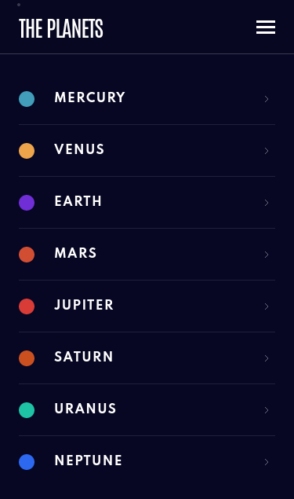

# Frontend Mentor - Planets fact site solution

This is a solution to the [Planets fact site challenge on Frontend Mentor](https://www.frontendmentor.io/challenges/planets-fact-site-gazqN8w_f). Frontend Mentor challenges help you improve your coding skills by building realistic projects.

## Table of contents

- [Overview](#overview)
  - [The challenge](#the-challenge)
  - [Screenshot](#screenshot)
  - [Links](#links)
- [My process](#my-process)
  - [Built with](#built-with)
  - [What I learned](#what-i-learned)
- [Author](#author)

## Overview

### The challenge

Users should be able to:

- View the optimal layout for the app depending on their device's screen size
- See hover states for all interactive elements on the page
- View each planet page and toggle between "Overview", "Internal Structure", and "Surface Geology"

### Screenshot

  
Desktop

  
Tablet

  
Mobile

### Links

- Solution URL: [Frontend Mentor Solution]()
- Live Site URL: [Github Pages](https://rmzvr.github.io/planets-fact/)

## My process

### Built with

- Semantic HTML5 markup
- (S)CSS Modules
- [React](https://reactjs.org/) - JS library
- React Hooks
- React Router

### What I learned

In this project, I practiced creating a multi-page site using react router, as well as css modules. I'm having trouble routing to github pages, but successfully solved the problem using a hashed URL.

## Author

- [Github](https://github.com/rmzvr)
- [LinkedIn](https://www.linkedin.com/in/rmzvr)
- [Codewars](https://www.codewars.com/users/rmzvr)
- [Frontend Mentor](https://www.frontendmentor.io/profile/rmzvr)